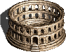

# homm3bg-rules
Rules and Reference for Heroes of Might and Magic 3 Boardgame

assets  and artwork  for games

assets  and artwork  for games

clickable (hyperlink) arrow: 

clickable (hyperlink) to markdown div block: 