# Table of Contents
- [Game Overview](#game-modes)
- [Setup](#setup)
- [Game Overview](#game-overview)
- [Iconography](#iconography)
- [Map Locations](#map-locations)
- [Components](#components)

---
---

# Game Modes
Each game of **Heroes of Might and Magic III: The Board Game** is played within a scenario or campaign, with each scenario having its own map, victory conditions, and rules. You will also be able to choose from a variety of Heroes, each with their unique abilities and decks, massively adding to the game's replayability.

**Heroes of Might and Magic III: The Board Game** may be played using any one of the four game modes listed below:

### CLASH
A fully competitive mode for 2-3 players. Pick your "Clash Mode" scenario from the mission book and vanquish your rivals before they defeat you!

### CAMPAIGN
You can also play **Heroes of Might and Magic III: The Board Game** in a single player mode - facing off against an enemy AI. The solo campaign mode consists of a series of interconnected scenarios following a gripping story arc. They feature unique events and interesting mechanics. For rules unique to solo mode, go to page 33 (TODO: UPDATE WITH CORRECT LINK)

### ALLIANCE
A 2 vs 2 team based format in which you team up with a friend against 2 other players. You will need an expansion pack to be able to play a 4+ player game. The scenarios and rules for Alliance mode can be found in any of the expansion pack rule books that add an additional faction.

### CO-OP
A cooperative mode for 2-3 players where everyone shares the same goal.

[ 📜 Back to Top](#table-of-contents)

---
---

# Setup

1. Decide various factors about the game:
    - a: Which [Game Mode](LINK:GAME_MODE) you will play (Recommended start: CLASH)
    - b: Which [Scenario](LINK:SCENARIOS) from among the chosen Game Mode you will play (Recommended start: "Brave New World")
    - c: Unless predetermined by the scenario, which [Faction](LINK:FACTIONS) each player will play as:
        - **Castle**: Lead your proud soldiers to victory with the support of Griffins and Angels!
        - **Dungeon**: Foul creatures and monsters lurk in the depths of the Dungeon, awaiting your command...
        - **Necropolis**: Rise once more and take your rightful place as the ruler of the dead!
    - d: Unless predetermined by the scenario, which one of your Faction's [Heroes](LINK:HEROES) will be your [Main Hero](LINK:MAIN_HERO).

2. Set up the shared components:
    - a: Set up map tiles according to the number of players and the Map tile layout shown in the Mission Book
    - b: Place the Combat Board next to the map. 
    - c: Place the Round Tracker next to the Map, and place a black cube on the first space of the tracker (represented by a "1").
    - d: Shuffle the Astrologers Proclaim cards and place them face-down next to the round tracker.
    - e: Group the resource tokens in separate piles located within reach of all players.

3. From the game box, take the following components belonging to your faction:
    - a: 1 x Double-sided Hero Card
    - b: 2 x Hero Model
    - c: 7 x Town Building Tile
    - d: 1 x Town Board
    - e: 7 x Double-sided Unit Card
    - f: 3 x Hero-specific Speciality Card
    - g: 1 Ability Card, matching your hero's particular ability
    - h: 20 x Faction cube
    - i: 1 x Build Token
    - j: 1 x Population Token
    - k: 1 x Spell Book Token

4. Set up the Card Decks:
    - a: Sort the Statistic cards into four piles: Attack, Defence, Power and Knowledge.
    - b: Sort the Ability, Artifact, and Spell cards into 3 face-down decks. Shuffle these decks. From each of these decks, take the top card and place it face-up next to its deck, creating 3 separate discard piles.
    - c: Sort the Neutral Units into 4 decks according to their Tier (Bronze, Silver, Gold, and Azure). Shuffle these decks individually and place them face-down, leaving enough room for their discard piles.

5. Set up your faction-specific components:
    - a: Place the Hero Card and Town Board in front of you. 
    - b: Prepare the Faction Town Building tiles by placing them beside the Town board. Check which buildings are already built in the scenario you are about to play and place the respective building tiles on the Town board. Place the Population, Build and Spell Book tokens in their spots on the town board.
    - c: Set your starting income - indicated by the scenario's rules - by placing faction cubes on the income tracks on the Town board.
    - d: Take the starting resources determined by the scenario you are playing, plus 3 movement tokens, and place them next to your Hero card. This is your resource pool.
    - e: Place a faction cube on the first space of the level tracker along the bottom of the Hero Card (Represented by a "I"). Your hero is now level 1.
    - f: Check the scenario for how many starting units you receive and separate them from your other faction units. Make sure to keep track of which units you have available and which you do not. Recommended: keep unavailable units on left side of player area with un-built town buildings, and keep available units on right side of player area with resources, movement tokens etc.

6. Create your initial [Might and Magic deck](LINK:MIGHT_AND_MAGIC_DECK):
    - a: Refer to your Hero Statistics on your Hero Card and take the corresponding number of cards from each pile (see page 11, Hero Card Information) (TODO: UPDATE LINK).
    - b: If your Main Hero is a hero of Might (TODO: ADD MIGHT ICON), add 1 copy of the Magic Arrow spell to your Might and Magic deck. If your Main Hero is a hero of Magic (TODO: ADD MAGIC ICON), add 2 copies of the Magic Arrow spell to your Might and Magic deck.
    - c: Add you Hero's Ability card and Level 1 Speciality card to your starting deck.
    - d: Shuffle your starting deck and place it face down next to your Hero card. Your deck is now ready for play. Recommended: keep the deck on the left side of play area, the discard on the right side, and the hand of cards in front of you

7. Choose the starting difficulty and take the corresponding Starting Bonus(es). (see page 35, Difficulty) (TODO: LINK TO DIFFICULTY)

8. Rotate your starting tile freely and place your hero model on the field with the Town.

9. Decide a starting player.

[ 📜 Back to Top](#table-of-contents)

---
---

# Game Overview

## Round Order
...

[ 📜 Back to Top](#table-of-contents)

---
---

# Iconography

## Quick Find

## Index
- [Gold](#gold)

## Descriptions

  

  ### Gold
  A [Resource](LINK:RESOURCES). Can be gained and spent
  

## arrow
... arrow pointing right

[ 📜 Back to Top](#table-of-contents)

---
---

# Map Locations

not included: 
- treasure symbol, artifact symbol, resource symbol (TODO: add to iconography instead)
- blocked field (TODO: include in other rules instead)

## Quick Find
<a href="#dragon-utopia" title="Dragon Utopia">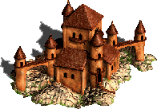</a>
<a href="#fountain-of-youth" title="Fountain of Youth">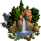</a>
<a href="#grail" title="Grail">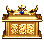</a>
<a href="#learning-stone" title="Learning Stone">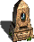</a>
<a href="#magic_spring" title="Magic Spring">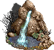</a>
<a href="#mine" title="Alchemists Lab">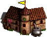</a>
<a href="#mine" title="Crystal Mine">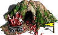</a>
<a href="#mine" title="Gem Pond">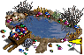</a>
<a href="#mine" title="Gold Mine">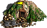</a>
<a href="#mine" title="Ore Mine">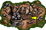</a>
<a href="#mystical-garden" title="Mystical Garden">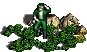</a>
<a href="#obelisk" title="Obelisk">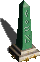</a>
<a href="#redwood-observatory" title="Redwood Observatory">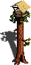</a>
<a href="#sanctuary" title="Sanctuary">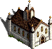</a>
<a href="#settlement" title="Castle Settlement">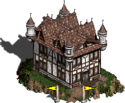</a>
<a href="#settlement" title="Conflux Settlement">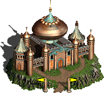</a>
<a href="#settlement" title="Cove Settlement">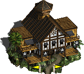</a>
<a href="#settlement" title="Dungeon Settlement">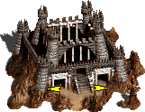</a>
<a href="#settlement" title="Fortress Settlement">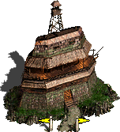</a>
<a href="#settlement" title="Inferno Settlement">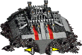</a>
<a href="#settlement" title="Necropolis Settlement">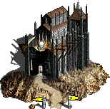</a>
<a href="#settlement" title="Rampart Settlement">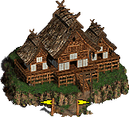</a>
<a href="#settlement" title="Stronghold Settlement">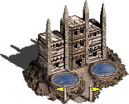</a>
<a href="#settlement" title="Tower Settlement">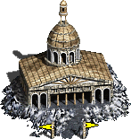</a>
<a href="#shrine-of-magic-gesture" title="Shrine of Magic Gesture">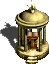</a>
<a href="#shrine-of-magic-incantation" title="Shrine of Magic Incantation">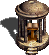</a>
<a href="#stables" title="Stables">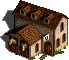</a>
<a href="#temple" title="Temple">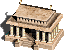</a>
<a href="#trading-post" title="Trading Post">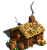</a>
<a href="#tree-of-knowledge" title="Tree of Knowledge">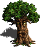</a>
<a href="#town" title="Castle Town">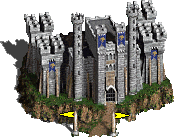</a>
<a href="#town" title="Conflux Town">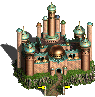</a>
<a href="#town" title="Cove Town">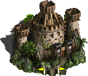</a>
<a href="#town" title="Dungeon Town">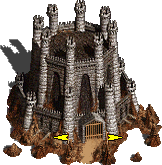</a>
<a href="#town" title="Fortress Town">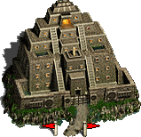</a>
<a href="#town" title="Inferno Town">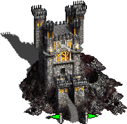</a>
<a href="#town" title="Necropolis Town">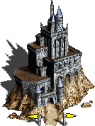</a>
<a href="#town" title="Rampart Town">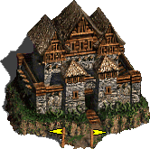</a>
<a href="#town" title="Stronghold Town">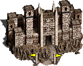</a>
<a href="#town" title="Tower Town">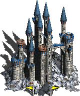</a>
<a href="#warriors-tomb" title="Warrior's Tomb">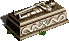</a>
<a href="#water-wheel" title="Water Wheel">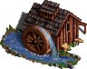</a>
<a href="#windmill" title="Windmill">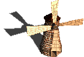</a>
<a href="#witch-hut" title="Witch Hut">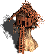</a>

## Index
- [Dragon Utopia](#dragon-utopia)
- [Fountain of Youth](#fountain-of-youth)
- [Grail](#grail)
- [Learning Stone](#learning-stone)
- [Magic Spring](#magic-spring)
- [Mine](#mine)
- [Mystical Garden](#mystical-garden)
- [Obelisk](#obelisk)
- [Redwood Observatory](#redwood-observatory)
- [Sanctuary](#sanctuary)
- [Settlement](#settlement)
- [Shrine of Magic Gesture](#shrine-of-magic-gesture)
- [Shrine of Magic Incantation](#shrine-of-magic-incantation)
- [Stables](#stables)
- [Temple](#temple)
- [Trading Post](#trading-post)
- [Tree of Knowledge](#tree-of-knowledge)
- [Town](#town)
- [Warrior's Tomb](#warriors-tomb)
- [Water Wheel](#water-wheel)
- [Windmill](#windmill)
- [Witch Hut](#witch-hut)

## Descriptions

  

  ### Dragon Utopia
  Category: [**Flaggable**](LINK:FLAGGABLE)

  The Effect depends on the scenario.
  

  

  ### Fountain of Youth
  Category: [**Visitable**](LINK:VISITABLE)

  The visiting [Hero](LINK:HERO) gains 1 additional <a href="#movement_point" alt="Movement Point" title="Movement Point">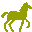</a> for this turn. Gain 1 .
  

  

  ### Grail
  Category: [**Visitable**](LINK:VISITABLE)

  Gain a [Grail Token](LINK:GRAIL_TOKEN).
  

  

  ### Learning Stone
  Category: [**Visitable**](LINK:VISITABLE)

  Gain 1 <a href="#experience" alt="Experience" title="Experience">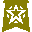</a>.
  

  

  ### Magic Spring
  Category: [**Visitable**](LINK:VISITABLE)

  You may look at the top 3 cards of your discard pile and take 1 of them back to your hand. Return the remaining cards to the top of your discard pile in any order.
  

  
  
  
  
  

  ### Mine
  Category: [**Flaggable**](LINK:FLAGGABLE)

  When you [Flag](LINK:FLAG) a Mine, increase your [Income](LINK:INCOME) corresponding to the resource provided by that mine type:
  - Gold Mine (): Increase your  [Income](LINK:INCOME) by 5 (1 Step)
  - Ore Mine (): Increase your <a href="#building_material" alt="Building Material" title="Building Material">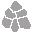</a> [Income](LINK:INCOME) by 2 (1 Step)
  - Alchemists Lab (), Crystal Mine (), Gem Pond (): Increase your  [Income](LINK:INCOME) by 1 (1 Step)
  
  If that Mine was not previously flagged, you also gain an immediate bonus according to the resource type of the mine:
  -  Mines: 5 
  -  Mines: 2 
  -  Mines: 1 

  If a Hero enters a field with a Mine owned by another player, the Hero Flags the Mine immediately.

  If you lose control of a Mine, decrease your Income for the corresponding resource by one step.

  Mines that have not yet been claimed are always defended by [Neutral Units](LINK:NEUTRAL_UNITS).

  

  ### Mystical Garden
  Category: [**Visitable**](LINK:VISITABLE)

  Choose one: Gain 2  or 1 .
  

  

  ### Obelisk
  Category: [**Flaggable**](LINK:FLAGGABLE)

  The Effect depends on the scenario. When a [Hero](LINK:HERO) visits this field, enemy [faction cubes](LINK:FACTION_CUBES) are not removed, meaning that there may be multiple cubes on the field. Once visited by a faction, the Obelisk counts as an empty field for that faction.
  

  

  ### Redwood Observatory
  Category: [**Visitable**](LINK:VISITABLE)

  [Discover a tile](LINK:DISCOVERTILE) adjacent to this one.
  

  

  ### Sanctuary
  Category: [**Revisitable**](LINK:REVISITABLE)

  [Heroes](LINK:HEROES) on this field cannot be attacked by other Heroes. If this field is occupied by a Hero, other Heroes cannot stay on it, but can move through it.
  

  
  
  
  
  
  
  
  
  
  

  ### Settlement
  Category: [**Flaggable**](LINK:FLAGGABLE)

  When you [Flag](LINK:FLAG) a Settlement, you may select one of the following effects:
  - Increase your  [Income](LINK:INCOME) by 5 (1 Step)
  - Increase your  [Income](LINK:INCOME) by 2 (1 Step)
  - Increase your  [Income](LINK:INCOME) by 1 (1 Step)
  - [Reinforce](LINK:REINFORCE) one of your [Bronze](LINK:BRONZE_UNITS) or [Silver](LINK:SILVER_UNITS) tier [Units](LINK:UNITS) for half the normal cost * (see page 27, Unit costs) (TODO: REVIEW RULING)
  
  If that Settlement was not previously controlled by any player, you also gain a bonus:
  - If you chose to increase your  Income, additionally gain 5 .
  - If you chose to increase your  Income, additionally gain 2 .
  - If you chose to increase your  Income, additionally gain 1 .
  - If you chose to Reinforce one of your Bronze or Silver units for half the normal cost, you may instead Reinforce that unit for free.
  
  If you choose to increase one of your Income tracks, place a corresponding [Resource Token](LINK:RESOURCE_TOKENS) on the field with the Settlement.

  If you lose control of a Settlement with a Resource Token on it, reduce your Income of that Resource by 1 step and remove the Resource Token from the Settlement.

  **This is a single-use effect. The settlement will not produce any further Income unless another player Flags it and chooses a different effect.*
  

  

  ### Shrine of Magic Gesture
  Category: [**Visitable**](LINK:VISITABLE)

  You may [Search (2)](LINK:SEARCH) the [Spell](LINK:SPELLS) deck.
  

  

  ### Shrine of Magic Incantation
  Category: [**Visitable**](LINK:VISITABLE)

  You may pay 3  to [Search (2)](LINK:SEARCH) the [Spell](LINK:SPELLS) deck.
  

  

  ### Stables
  Category: [**Revisitable**](LINK:REVISITABLE)

  The visiting [Hero](LINK:HERO) gains 1 additional  for this turn.
  

  

  ### Temple
  Category: [**Visitable**](LINK:VISITABLE)

  Gain 1 .
  

  

  ### Trading Post
  Category: [**Revisitable**](LINK:REVISITABLE)

  You may [exchange resources](LINK:EXCHANGE_RESOURCES) or [remove a card](LINK_REMOVE_A_CARD) (see page 16)(TODO: CHECK RULING)
  

  

  ### Tree of Knowledge
  Category: [**Visitable**](LINK:VISITABLE)

  You may pay 3  or 10  to gain 2 .
  

  
  
  
  
  
  
  
  
  
  

  
  ### Town
  Category: [**Flaggable**](LINK:FLAGGABLE)

  This is a player's starting field. If a player [captures](LINK:CAPTURE) a Town, they gain a bonus depending on the scenario.

  

  
  ### Warrior's Tomb
  Category: [**Visitable**](LINK:VISITABLE)

  You may [Search (2)](LINK:SEARCH) the [Artifact](LINK:ARTIFACT) deck, twice. If you do, gain 2 .
  

  

  ### Water Wheel
  Category: [**Visitable**](LINK:VISITABLE)

  Gain 3 .
  

  

  
  ### Windmill
  Category: [**Visitable**](LINK:VISITABLE)

  Gain 1 .
  

  

  ### Witch Hut
  Category: [**Visitable**](LINK:VISITABLE)

  You may either [Remove](LINK:REMOVE) an [Ability card](LINK:ABILITYCARD) from your hand or look at the top card of the Ability deck and put that card into your hand or into the Ability deck discard pile.
  

[ 📜 Back to Top](#table-of-contents)

---
---

# Components

## Booklets
- 1 x Rulebook (Base Bame)
- 1 x Mission Book
    - 1 x Mission Book (Base Game)
- 1 x Tournament Book (Base Game)

## Aids
- 3 x Player Aid

## Map Tiles
- 20 x Map Tiles
    - 3 x I (Starting) Tile
    - 9 x II-III (Far) Tile
    - 6 x IV-V (Near) Tile
    - 2 x VI-VII (Center) Tile

## Boards
- 1 x Combat Board

## Round Tracker
- 1 x Round Tracker

## Dice
- 2 x Attack Dice
- 3 x Resource Dice
- 3 x Treasure Dice

## Town Boards
- 3 x Town Boards

## Hero Boards
- 3 x Hero Boards

## Cards
- Might & Magic Cards:
    - 30 x Ability Cards
    - 32 x Artifact Cards
    - 46 x Spell Cards
    - 18 x Speciality Cards
    - 24 x Statistic Cards
- Combat Cards:
    - 3 x Wall Card
    - 1 x Gate Card
    - 1 x Arrow Tower Card
- Other Cards:
    - 21 x Unit Cards
    - 41 x Neutral Unit Cards
    - 20 x AI Cards
    - 19 x Astrologers Proclaim card

## Tokens
- Resource Tokens
    - 33 x Gold Tokens
    - 21 x Building Materials Tokens
    - 16 x Valuables Tokens
- Town Tokens
    - 3 x Build Token
    - 3 x Population Token
    - 3 x Spell book Token
- Combat Tokens
    - 15 x Damage Token
    - 6 x Paralysis/Defense Token
- Other Tokens
    - 17 x Movement Token
    - 1 x Grail Token

## Cubes
- 40 x Black Cubes
- 20 x Blue Cubes
- 20 x Purple Cubes
- 20 x Gray Cubes

## Models
- 6 x Hero Model
